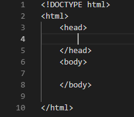

## About
Last Updated *[09/04/2019]*   
Created by [OSU Maps and Spatial Data](https://info.library.okstate.edu/map-room)


## Table of Contents
- Introduction 
- *Leaflet*
- - Page Set Up
- - Adding the Map
- Conclusion
- Further Reading/Resources

## Introduction
Incorportaing user-friendly maps into your website is not an easy task. Luckily there is a way to achieve this goal that is quick and intuitive.

## *Leaflet*
Leaflet is one of the top sources for mobile-friendly interactive maps. It is simple to use and works well across all major desktop and mobile platforms. Leaflet is a great tool for incorporating easy-to-use interactive maps into your website.

#### Page Set Up
1. Before we begin, open a new workspace, preferably one with a live viewer if you have access to one. 
2. Set up your page with the required code. Include the doctype, html, head, and body tags.



3. Add the Leaflet CSS stylesheet link to the *head* of the document.
   ```html
   <link rel="stylesheet" href="https://unpkg.com/leaflet@1.5.1/dist/leaflet.css"
   integrity="sha512-xwE/Az9zrjBIphAcBb3F6JVqxf46+CDLwfLMHloNu6KEQCAWi6HcDUbeOfBIptF7tcCzusKFjFw2yuvEpDL9wQ=="
   crossorigin=""/>
   ```
4. Add the Leaflet Javascript file after Leaflet CSS.
   ```html
   <script src="https://unpkg.com/leaflet@1.5.1/dist/leaflet.js"
   integrity="sha512-GffPMF3RvMeYyc1LWMHtK8EbPv0iNZ8/oTtHPx9/cc2ILxQ+u905qIwdpULaqDkyBKgOaB57QTMg7ztg8Jm2Og=="
   crossorigin=""></script>
   ```
5. Add a *div* element within the body tag where you would like the map to appear. You can give it a different ID if you prefer.
   ```html
   <div id="mapid"></div>
   ```
6. Within the *head* add a *style* tag. 
   ```html
   <style></style>
   ```
7. We will create CSS attributes for the map. In the *style* tag, add the height attributes and anything else you would like to add to your map.
   ```html
   #mapid { height: 180px; }
   ```

#### Adding the Map
1. Within the *body* tag, add a script tag.
   ```html
   <script></script>
   ```
2. Within the *script* tag, create the map variable.

Example:
   ```html
   var mymap = L.map('mapid').setView([coordinate 1, coordinate 2], zoom);
   ```
   ```html
   var mymap = L.map('mapid').setView([51.505, -0.09], 13);
   ```
 3. Next, we will add the the tile layer for the map.
 
 Example:
   ```html
   L.tileLayer('https://api.tiles.mapbox.com/v4/{id}/{z}/{x}/{y}.png?access_token={accessToken}', {
	attribution: 'Map data &copy; <a href="https://www.openstreetmap.org/">OpenStreetMap</a> contributors, <a href="https://creativecommons.org/licenses/by-sa/2.0/">CC-BY-SA</a>, Imagery © <a href="https://www.mapbox.com/">Mapbox</a>',
	maxZoom: 18,
	id: 'mapbox.streets',
	accessToken: 'your.mapbox.access.token'
}).addTo(mymap);
   ```
   ```html
   L.tileLayer('https://api.tiles.mapbox.com/v4/{id}/{z}/{x}/{y}.png?access_token={accessToken}', 
            {
    attribution: 'Map data &copy; <a href="https://www.openstreetmap.org/">OpenStreetMap</a> contributors, <a href="https://creativecommons.org/licenses/by-sa/2.0/">CC-BY-SA</a>, Imagery © <a href="https://www.mapbox.com/">Mapbox</a>',
	maxZoom: 18,
	id: 'mapbox.streets',
	accessToken: 'pk.eyJ1IjoibWFwYm94IiwiYSI6ImNpejY4NXVycTA2emYycXBndHRqcmZ3N3gifQ.rJcFIG214AriISLbB6B5aw'
}).addTo(mymap);
   ```
4. Your map should be visible in the the live viewer.


## Conclusion

## Further Reading/Resources


[Return to Top](#about)
